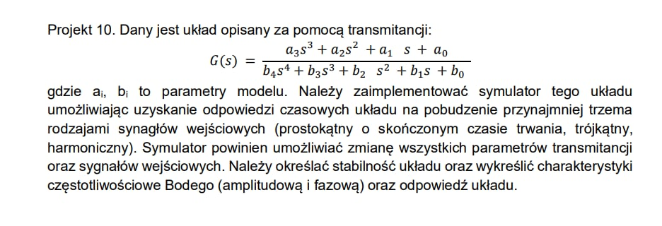

# Symulator-Transmitancji

## Polecenie Projektu

## O Projekcie

Celem projektu było stworzenie narzędzia umożliwiającego:

- Modyfikację parametrów transmitancji oraz sygnałów wejściowych z poziomu interfejsu graficznego.
- Symulację odpowiedzi czasowej dla różnych typów sygnałów wejściowych (prostokątny, trójkątny, harmoniczny, impuls jednostkowy, skok jednostkowy).
- Analizę stabilności układu z wykorzystaniem kryterium Routha-Hurwitza.
- Generowanie charakterystyk częstotliwościowych Bodego (amplitudowych i fazowych).
- Wizualizację biegunów układu w płaszczyźnie zespolonej.

### Funkcje Projektu

- **Interfejs Graficzny (Tkinter):** Intuicyjne GUI pozwala użytkownikowi definiować współczynniki transmitancji oraz parametry sygnałów wejściowych.
- **Numeryczna Symulacja (Metoda Eulera):** Umożliwia dokładną analizę odpowiedzi układu.
- **Charakterystyki Bodego:** Ręcznie implementowana analiza częstotliwościowa układu.
- **Ocena Stabilności:** Wyznaczanie biegunów układu i ich wizualizacja w płaszczyźnie zespolonej.
